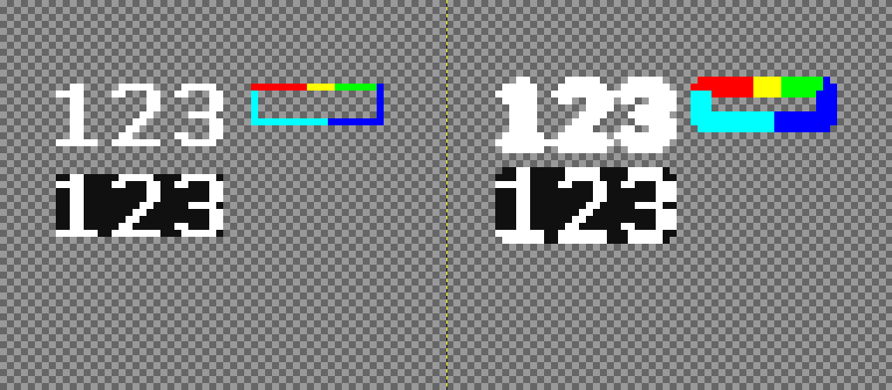

## PixInflate

This is a GIMP Plug-In that grows border pixels in cardinal directions.

### Installation

Copy the python file in the plug-in folder, e.g. AppData\Roaming\GIMP\2.10\plug-ins on Windows.